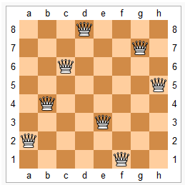

# n-皇后问题

## 题目描述

n−皇后问题是指将 n 个皇后放在 n×n 的国际象棋棋盘上，使得皇后不能相互攻击到，即任意两个皇后都不能处于同一行、同一列或同一斜线上。



## 输入格式

共一行，包含整数 n。

## 输出格式

每个解决方案占 n 行，每行输出一个长度为 n 的字符串，用来表示完整的棋盘状态。

其中 `.` 表示某一个位置的方格状态为空，`Q` 表示某一个位置的方格上摆着皇后。

每个方案输出完成后，输出一个空行。

**注意：行末不能有多余空格。**

输出方案的顺序任意，只要不重复且没有遗漏即可。

## 数据范围

1 ≤ n ≤ 9

## 输入样例

```
4
```

## 输出样例

```
.Q..
...Q
Q...
..Q.

..Q.
Q...
...Q
.Q..
```

## 思路

DFS 回溯，逐行放置皇后：

- `col[i]`：第 i 列是否已有皇后
- `dg[u + i]`：主对角线（/ 方向）是否已有皇后
- `udg[n - u + i]`：副对角线（\ 方向）是否已有皇后

## 参考代码

```cpp
#include <iostream>
#include <cstring>
#include <algorithm>

using namespace std;
const int N = 20;

int n;
char g[N][N];
bool col[N], dg[N], udg[N];


void dfs(int u)
{
    if(u == n)
    {
        for(int i = 0; i < n; i ++ ) puts(g[i]);
        puts("");
        return;
    }
    
    for(int i = 0; i < n; i ++ )
        if(!col[i] && !dg[u + i] && !udg[n - u + i])
        {
            g[u][i] = 'Q';
            col[i] = dg[u + i] = udg[n - u + i] = true;
            dfs(u + 1);
            g[u][i] = '.';
            col[i] = dg[u + i] = udg[n - u + i] = false;
        }
}


int main()
{
    ios::sync_with_stdio(false);
    cin.tie(0);
    
    cin >> n;
    for(int i = 0; i < n; i ++ )
        for(int j = 0; j < n; j ++ )
            g[i][j] = '.';
    
    dfs(0);
    
    return 0;
}
```
